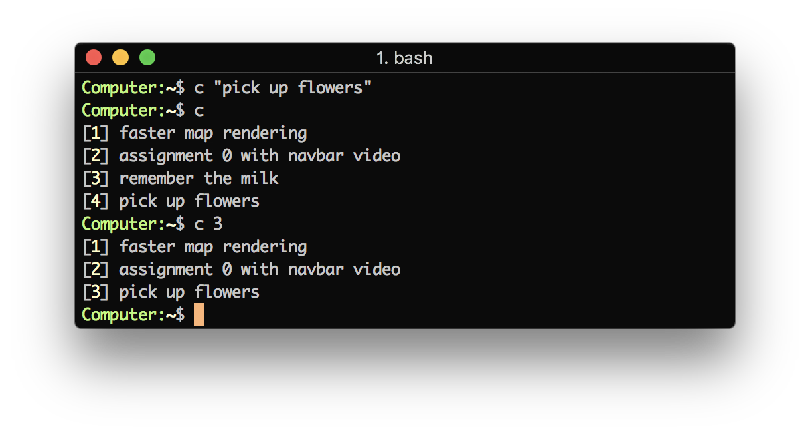

# cdo
cdo - another minimalist todolist

The best feature is no features! Just a simple list that loads up a savefile and allows given entries to be deleted without a running state.

local savefile has a purposely-obfuscated byte order such that cheating on your todos or careless adding and deletion of tasks is *not* recommended.
 
Proudly released under the new [GLWT license](https://github.com/me-shaon/GLWTPL/blob/master/LICENSE).

# TODO
- [x] Add a splash of color
- [x] Add help flags 
- [x] Config for dropbox piggybacking
- [ ] shift out to envvar settings
